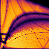
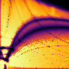
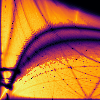

# The Algorithm

The algorithm computes a normalized volume (between 0 and 1) is roughly split into 4 steps:

1. [Compute a tessellation](algorithm.md#compute-a-tessellation)
2. [Compute side-length values](algorithm.md#compute-side-length-values)
3. [Trim simplices](algorithm.md#trim-simplices)
3. [Compute the normalization](algorithm.md#compute-the-normalization)

## Compute a Tessellation

After integrating an orbit, you should be able to extract a raw point-array of its position over time.
This point array is passed into a tessellation algorithm.

For this specific implementation, [SciPy's Delaunay Tessellation](https://docs.scipy.org/doc/scipy/reference/generated/scipy.spatial.Delaunay.html) routine is used, which itself calls out to [Qhull](http://www.qhull.org/) under-the-hood.

## Compute Side-Length Values

The important values to compute here are the smallest side-lengths and longest side-lengths of the simplices in our tessellation.
These are what will be used in our trimming condition.

## Trim Simplices

The median of the smallest simplex side-lengths probes the length-scale of "related" parts of an orbit.
If a simplex' longest side is significantly larger than this value, it likely connects unrelated parts of the orbit and should be trimmed.

This threshold is referred to as the **axis ratio**, and is set to `10` by default.
The trimming condition can be written out as so:

$$ \frac{\text{longest side}}{\text{median(all shortest sides)}} > \text{axis ratio} $$

## Compute the Normalization

There is some delicacy in choosing an appropriate normalization.
The canonical choice is a [hypersphere](https://en.wikipedia.org/wiki/N-sphere) that encapsulates the whole orbit, but orbits rarely fill a whole hypersphere, resulting in poor dynamic range.

In 2D, the default normalization a circle that encapsulates the orbit (routine name is `circle`).
This is the only normalization routine available.

In 3D, the default normalization takes 4 rotated copies of the point array and computes its convex hull (routine name is `convexhull_rot4`).

### Normalization Routines in 3D

=== "Sphere"
    { width=50% align=left }

    50×50 image of a slice of phase space, generated by [commensurability](https://github.com/ilikecubesnstuff/commensurability), using orbit tessellation with `sphere` normalization.

=== "Cylinder"
    { width=50% align=left }

    50×50 image of a slice of phase space, generated by [commensurability](https://github.com/ilikecubesnstuff/commensurability), using orbit tessellation with `cylinder` normalization.

=== "Convex Hull"
    { width=50% align=left }

    50×50 image of a slice of phase space, generated by [commensurability](https://github.com/ilikecubesnstuff/commensurability), using orbit tessellation with `convexhull` normalization.

    !!! note "Co-rotation Tracks"
        Co-rotation resonance tracks are difficult to detect with this normalization routine.
        See the lines near the bottom right of the image.

=== "Convex Hull in $R$ vs $z$"
    { width=50% align=left }

    50×50 image of a slice of phase space, generated by [commensurability](https://github.com/ilikecubesnstuff/commensurability), using orbit tessellation with `Rz_convexhull` normalization.

=== "4 Rotated Convex Hulls"
    { width=50% align=left }

    50×50 image of a slice of phase space, generated by [commensurability](https://github.com/ilikecubesnstuff/commensurability), using orbit tessellation with `convexhull_rot4` normalization.

    !!! note "4-fold Symmetry"
        Orbits with 4-fold symmetry are difficult to detect with this normalization routine.
